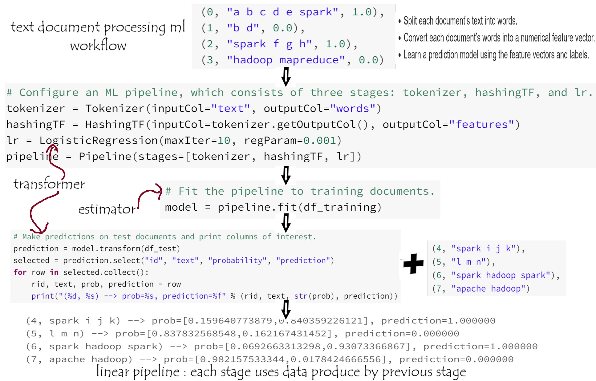

# DataWorks Summit 2018
> https://dataworkssummit.com/berlin-2018/

## Machine-Learning-techniques-with-Apache-Spark

This workshop was providing a hands on introduction to basic Machine Learning techniques with Apache Spark ML using the cloud. 

This repository contains the hands on notes on machine learning examples with Spark ML.

I used Databricks Community Edition's free version of our cloud-based big data platform, https://community.cloud.databricks.com/login.html?

## spark.ml VS spark.mllib

- spark.mllib contains the original API built on top of RDDs. 

- spark.ml provides higher-level API built on top of DataFrames for constructing ML pipelines.

ML is the new implementation + Pipelines + Dataframes + Easier to construct a practical machine learning pipeline
 

 

## ML Pipelines 

- LogisticRegression_HashingTF_Tokenizer_text_parsing_pipeline

## Execute notebook on cloude.

- In this workshop we used 'Zepl', a Web-based notebook to get started with spark application. 
> https://www.zepl.com/USU1XQILT/spaces/S_ZEPL/d9f6f52521cb4ff5ad24851a5756d664

- Other solution to get start with Spark is to use Jupyter notebook from databricks community cloud.
> https://community.cloud.databricks.com/?o=4222224209897404

## Collection of my Spark ML exercises resources
- Machine Learning Models Overview (5 min)
> https://www.youtube.com/watch?v=ggIk08PNcBo																								

- IoT & Data Science Trucking Demo Blog + Videos	
> https://hortonworks.com/blog/iot-data-science-trucking-demo-dsx-local-apache-nifi/																								
- Hortonworks Community Connection (HCC)	
> https://community.hortonworks.com/index.html																								

- Visual Intro to Machine Learning (Decision Trees)	
> http://www.r2d3.us/visual-intro-to-machine-learning-part-1/																								
- TensorFlow Playground	
> https://playground.tensorflow.org																								

- P-Hacking	
> https://projects.fivethirtyeight.com/p-hacking/												

- https://spark.apache.org/docs/latest/ml-pipeline.html

- https://spark.apache.org/docs/2.2.0/mllib-linear-methods.html#logistic-regression

 - https://spark.apache.org/docs/latest/mllib-data-types.html#local-vector
 
 - https://github.com/apache/spark/tree/master/examples/src/main/python/ml
 
 - https://spark.apache.org/docs/2.0.2/ml-classification-regression.html
 
 - https://spark.apache.org/docs/latest/ml-features.html

- https://de.hortonworks.com/tutorial/sentiment-analysis-with-apache-spark/

